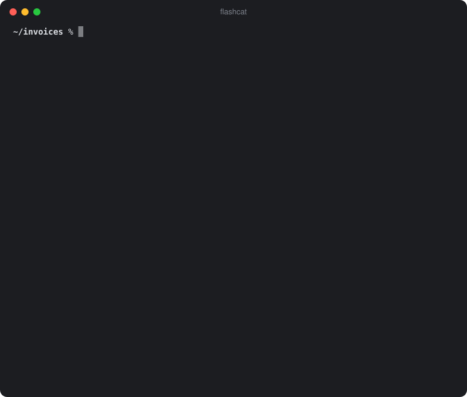

# Flashcat

<p align="center"></p>

**A local AI assistant for the macOS terminal.** Flashcat chats with you, reads and writes files in the
folder you start it in, looks at images, reads PDFs, Word and Excel files (even scans), and can search
the web — all with a model that runs **on your own Mac** through [LM Studio](https://lmstudio.ai) or LM Studio Bionic.
Nothing you ask leaves your computer unless you allow a web request: a private, offline AI chat for your
MacBook, powered by a local LLM (Google Gemma 4).

Named after Flash, my cat. 🐈 **Website:** [tomtomsen765.github.io/flashcat](https://tomtomsen765.github.io/flashcat/)

## Install

1. Install **[LM Studio](https://lmstudio.ai/download)** or its newer agent app
   **[LM Studio Bionic](https://lmstudio.ai/blog/introducing-lm-studio-bionic)** (both on the
   [download page](https://lmstudio.ai/download)) and open it once. Either one works: both bring the
   `lms` command and the local server that Flashcat uses, and they can be installed side by side.
2. Run this in the terminal:

```sh
curl -fsSL https://raw.githubusercontent.com/TomTomsen765/flashcat/main/install.sh | bash
```

The installer checks your Mac, installs the `flashcat` command into `~/.local/bin` and downloads the
default model, **Gemma 4 26B** (about 15.6 GB), through LM Studio.

**Requirements:** macOS on Apple Silicon and Apple's command line tools (`xcode-select --install`)
for Python.

### Prefer to read the code before running it?

Good habit. Download the repository, look at the installer, then run it from there – it then uses
the files you just read instead of downloading them:

```sh
git clone https://github.com/TomTomsen765/flashcat.git
cd flashcat
less install.sh          # what it does, in about 140 lines
bash install.sh
```

What the installer changes on your Mac, and nothing else:

- copies `flashcat`, `flashcat-chat.py` and `flashcat-cleanup` from `bin/` into `~/.local/bin`
- adds `~/.local/bin` to your `PATH` in `~/.zshrc`, if it isn't there yet
- installs the Python package `pygments` for colored code (`pip install --user`, optional)
- downloads the model through LM Studio (skip with `FLASHCAT_SKIP_MODEL=1 bash install.sh`)

Flashcat itself is one Python file using only the standard library
([`bin/flashcat-chat.py`](bin/flashcat-chat.py)) and a short launcher ([`bin/flashcat`](bin/flashcat)).

### Which Mac?

Flashcat is built and tuned on a **MacBook Air M5 with 24 GB** of memory — the minimum for the
default model (Gemma 4 26B, about 15.6 GB, 64k context).

| Memory | Experience |
|---|---|
| **less than 24 GB** | difficult – the model barely fits, answers get slow |
| **24 GB** | okay – **close all other apps** (browser, Bionic, chat apps …) while you use Flashcat. If they stay open, macOS moves parts of the model to disk and answers become much slower. |
| **32 GB or more** | smooth – you can keep your other apps open |

It should run on any Apple Silicon Mac (M1 or newer) with enough memory, but **older chips are
untested** – expect slower answers, since speed depends mostly on the chip, not on Flashcat. Most
base M1 and M2 models have at most 16 GB, which is too little for the default model. If you try it
on another Mac, please [let me know](https://github.com/TomTomsen765/flashcat/issues) how it runs.

## Use

```sh
cd ~/Documents/my-project
flashcat
```

Then just talk to it:

```
❯ Summarize @contract.pdf and put the deadlines into deadlines.md

  ◇ reads contract.pdf                                         ✓ 0.4 s
  ◇ writes deadlines.md
  ? Write? [Y/N] y
  ✓ created: deadlines.md

⏺ The contract runs until …
```

| Command | |
|---|---|
| `/help` | all commands |
| `/undo` | undo the last file change |
| `/copy`, `/save` | copy or save the last answer |
| `/resume` | earlier chats in this folder |
| `/compact` | summarize the chat to free context |
| `/think` | think more thoroughly (slower) |
| `Esc` | cancel the current answer |
| `@file` | attach a file to your message (Tab completes) |

Start options: `flashcat --continue` (last chat), `flashcat --models`, `flashcat --model <name>`,
`flashcat --update`.

Put standing instructions into a `FLASHCAT.md` in your project folder (or `~/.flashcat/FLASHCAT.md`
for all folders). A folder's `FLASHCAT.md` is shown and only loaded after you agree – the first time
and whenever it changes.

### Settings

| Environment variable | |
|---|---|
| `FLASHCAT_CONTEXT` | context size in tokens – default 65536 on Macs with 24 GB or more, 16384 below |
| `FLASHCAT_API_KEY` | only needed if you turned on *Require authentication* in LM Studio's server settings |

Flashcat uses the port set in LM Studio's server settings automatically.
Your chats are stored only on your Mac, in `~/.flashcat/sessions` (`/resume` lists them).

**Troubleshooting:** open LM Studio once, check that the model is downloaded (`flashcat --models`), and close other large apps if answers are slow.

## What it can do

- **Files:** list, read, search, create and change text files; create Word (`.docx`) and PDF documents;
  rename and move files
- **Documents:** reads PDF, Word, Excel — scanned PDFs and images via macOS text recognition
- **Images:** describes and analyzes pictures in the folder
- **Coding:** reads, explains, writes and fixes code in the folder – you confirm every change. It is
  no [Claude Code](https://claude.com/claude-code), but it does a solid job on simple tasks, and it is
  free and runs entirely on your Mac
- **Web:** web search (DuckDuckGo) and reading web pages
- **Terminal:** answers stream live with Markdown, tables and syntax-highlighted code; clickable file names

## Safety

Flashcat is built so that nothing happens behind your back. In short: **it only sees the folder you
start it in, it asks before every change and every internet access, and your private data stays
locked.** Details: [SECURITY.md](SECURITY.md).

**Your files**
- Flashcat only sees the folder it was started in and its subfolders. `../`, absolute paths and
  links pointing outside are blocked.
- **Private data is locked**, even when started in the home folder: everything hidden directly in
  your home folder (`~/.ssh`, `~/.zshrc`, `~/.config`, shell history, …), `~/Library` (keychains,
  browser data, mail, messages) and private key files (`id_rsa`, `*.pem`, …). If you really need one
  of them, Flashcat asks first – in red – and unlocks only that item, only for the current chat.
- Starting it in your home folder asks first – before the model is even loaded.
- It cannot delete files or run commands, and moving never overwrites anything.

**Every change asks first**
- You see a preview of every new file and every change before you answer `Y`. Long previews are
  shortened – answer `A` to see everything first.
- The old version is backed up in `.flashcat-backup/` (kept out of git automatically); `/undo`
  reverts the last change. Flashcat itself cannot change or remove the backups.

**Every internet access asks first**
- Web searches and web pages are only fetched after your `Y` – nothing leaves your Mac before that,
  not even a name lookup. You always see the complete address or search term, never a cut-off one.
- Addresses on your own computer or local network are always blocked, also after redirects.
- Hidden characters that could disguise what you see (terminal escape codes, invisible text-direction
  marks) are removed from everything Flashcat shows.

**Instructions from others**
- A `FLASHCAT.md` in a folder (e.g. in a downloaded project) is shown to you and only used after you
  allow it – and again whenever it changes.

**Your data stays on your Mac**
- The model runs locally in LM Studio. Chats are stored only in `~/.flashcat`, readable only by your
  user account. LM Studio is unloaded again when the last Flashcat window closes, so the memory is freed.

**Installing and updating**
- The installer only does what it describes. If the download breaks off, nothing runs at all.
  `flashcat --update` uses the same installer and keeps your chats and the model.

Found a security problem? Please report it privately – see [SECURITY.md](SECURITY.md).

> **Please double-check important results.** Flashcat is powered by a language model, and language
> models make mistakes – with numbers, dates and facts too. Check anything that matters (contracts,
> amounts, deadlines) against the original.

## Update

```sh
flashcat --update
```

Installs the newest version. Your chats, settings and the downloaded model stay.
(Versions before this command existed: run the install command once more.)

## Uninstall

```sh
curl -fsSL https://raw.githubusercontent.com/TomTomsen765/flashcat/main/uninstall.sh | bash
```

## License

Flashcat is released under the [MIT License](LICENSE).

The default model is **not** part of Flashcat: the installer downloads
[Gemma 4 26B (QAT, GGUF)](https://huggingface.co/lmstudio-community/gemma-4-26B-A4B-it-QAT-GGUF) from
Hugging Face through LM Studio. It is made by Google and comes with its own license and terms of use –
see the model page. The same applies to any other model you use with `flashcat --model`.
LM Studio has its own terms as well.
